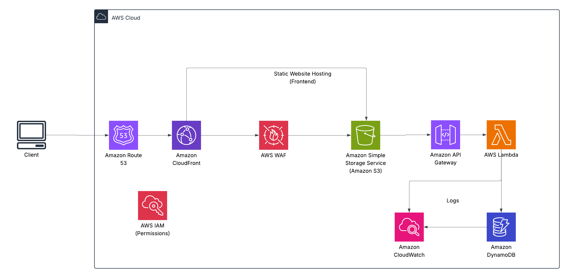

# 📦 Serverless REST API with AWS – Secure, Scalable To-Do Application

This project presents a **production-ready, serverless architecture** for managing a simple CRUD-based To-Do application using AWS-native services. The backend is built using AWS Lambda, API Gateway, and DynamoDB, while the frontend is hosted statically on S3 and delivered through CloudFront with a custom domain via Route 53.

The system is **fully serverless**, cost-effective, highly scalable, and secured with WAF, IAM, and CloudWatch monitoring.

---
## 🖼️ Architecture Diagram

---

## 🧱 Architecture Components

### 💻 Client Layer
- **Client (Browser)**: Interacts with the API through HTTP requests (e.g., creating, retrieving, or deleting to-do items).
- Frontend is hosted on **Amazon S3** and distributed via **CloudFront** for optimal performance and global access.

---

### 🌐 Networking and Routing

- **Amazon Route 53**
  - Handles domain resolution for both the frontend (`www.mytodo.com`) and backend API (`api.mytodo.com`).
  - Provides custom domain routing and DNS failover capabilities.

- **Amazon CloudFront**
  - Distributes the static website globally with low latency.
  - Protects origin (S3) and enables HTTPS + caching.

- **AWS WAF**
  - Web Application Firewall that filters incoming traffic.
  - Blocks malicious patterns such as SQL Injection, XSS, and bot traffic.
  - Applied at the CloudFront layer for both frontend and API traffic.

---

### 🧰 Application/API Layer

- **Amazon API Gateway**
  - Exposes RESTful endpoints such as:
    - `GET /todos`
    - `POST /todos`
    - `PUT /todos/{id}`
    - `DELETE /todos/{id}`
  - Handles throttling, authorization, request validation, CORS, and caching.
  - Connected directly to Lambda for execution.

- **AWS Lambda**
  - Stateless compute layer that executes business logic.
  - Each CRUD operation is mapped to a Lambda function.
  - Uses environment variables to reference table names, API keys, etc.

---

### 💾 Database Layer

- **Amazon DynamoDB**
  - Fully-managed NoSQL database for storing to-do items.
  - Fast, low-latency, and scalable.
  - Each record includes:
    - `id`: string (Primary Key)
    - `title`: string
    - `completed`: boolean
    - `createdAt`: timestamp

- **Data Access Pattern**
  - Lambda reads/writes directly to DynamoDB.
  - Optimized for single-table design and indexed reads.

---

### 🔐 Security Layer

- **AWS IAM (Identity & Access Management)**
  - Roles control permissions for Lambda to interact with DynamoDB, CloudWatch, and API Gateway.
  - IAM policies follow the principle of least privilege.

- **(Optional) Amazon Cognito**
  - Could be used in future to enable user sign-up/sign-in with JWT tokens for API access control.

- **Security Best Practices**
  - Lambda and DynamoDB access are restricted via tightly-scoped roles.
  - API Gateway endpoints are protected using resource policies and throttling.
  - WAF blocks suspicious traffic.
  - All endpoints are served via HTTPS.

---

### 📊 Monitoring and Logging

- **Amazon CloudWatch**
  - Logs all Lambda function executions, API Gateway access logs, and error rates.
  - Enables custom dashboards, alarms, and metrics.

- **CloudWatch Metrics Examples:**
  - `5XXError`: Alerts on failed Lambda/API invocations.
  - `DynamoDB ThrottledRequests`: Ensures DB scaling is sufficient.
  - `Lambda Duration`: Helps optimize function performance.

- **CloudWatch Alarms (Optional):**
  - Set alarms to notify when:
    - API error rate > 5%
    - Lambda errors > 1
    - DynamoDB throttles detected

---

## 🏗️ Infrastructure Summary

| Component              | Service                    | Purpose                                                        |
|------------------------|----------------------------|----------------------------------------------------------------|
| Frontend Hosting       | S3 + CloudFront            | Hosts and delivers static React/HTML content                   |
| Domain + Routing       | Route 53                   | Resolves custom domains and routes traffic                     |
| Security               | WAF, IAM                   | Web filtering + permission control                             |
| API Exposure           | API Gateway                | REST API endpoints for client consumption                      |
| Business Logic         | Lambda                     | Executes stateless application logic                           |
| Data Storage           | DynamoDB                   | Stores to-do data in a NoSQL table                             |
| Observability          | CloudWatch                 | Logs, metrics, dashboards, alarms                              |

---

## 🧠 Technologies Used

- AWS Lambda (Node.js / Python)
- Amazon API Gateway
- Amazon DynamoDB
- Amazon S3
- CloudFront
- AWS IAM
- AWS WAF
- Route 53
- CloudWatch

